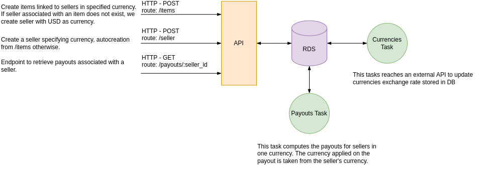
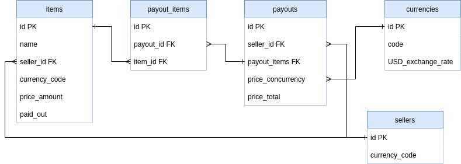

./handler (where the business logic happens) reaches coverage: 93.3% of statements :smile:

## Table of Contents

- [Goals](#goals)
- [Overview](#overview)
- [Architecture](#architecture)
- [Data Model](#data-model)
- [Design considerations](#design-considerations)
  - [Sellers and currencies](#sellers-and-currencies)
  - [Background task: Currencies Update](#background-tasks-currencies-update)
  - [Background task: Payouts Creation](#background-task-payouts-creation)
  - [Testing Strategy](#testing-strategy)
- [Setup](#setup)
  - [Requirements](#Requirements)
  - [Run](#Run)
- [Quality code](#quality-code)
  - [Testing](#testing)
  - [Linting](#linting)
- [Documentation](#documentation)

## Goals

Write an API call that accepts a list of sold Items and creates payouts for the sellers.

Following limitations apply:

1. Every Payout is associated with only one seller and only one currency,
2. The amount of money in the created Payouts should be equal to the total price amounts of Products in request,
3. Every transaction costs us money, so we’d like to have as little number of Payouts per seller as possible,
4. Every Payout amount should not exceed a certain limit (we can’t send a million with one single transaction); if a Payout exceeds said amount, we should split it,
5. Every Payout should be linked with at least one Item, so that we know exactly what Items have been paid out with each transaction


## Overview

The proposed solution is an HTTP API allowing requests to create items and retrieve payouts for sellers. Asynchronous tasks are ran in the background to create payouts at given time interval. The implementation of asynchronous tasks comes from one of the above limitation "3. Every transaction costs us money, so we’d like to have as little number of Payouts per seller as possible". I understand from this statement that there is no need to synchronously create payouts from sent items. A delayed creation of payouts give us the opportunity to architecture an efficient asynchronous solution.

### Architecture



### Data Model



## Design considerations

### Folder structure

- `./cmd` holds the application main entry point,
- `./docs` holds swagger documentation,
- `./internal` holds business specific logic,
- `./migrations` holds SQL migrations,
- `./pkg` holds generic logic that could be externalized in a common library repository.

### Sellers and currencies 

In an ideal scenario, upon registration a seller selects a currency in which it wants payouts. As such, in this current implementation, if we send a list of items with an unknown seller, we auto-create the seller with USD as default currency. It is not ideal, in production, if a seller does not exist we would discard the items and payouts. A seller API should exists for this intent. The `retrieveOrCreateSeller` function is only a temporary development solution. Otherwise, we can create a seller with a specific currency using the HTTP enpoint `/seller`.

### Background task: Currencies Update

We have two tasks running the background (1. Payouts creation and 2. Currencies update). I did not couple these tasks. They will run at the time interval we give them. On the one hand, major [fiat currencies](https://en.wikipedia.org/wiki/Fiat_money) volality is commonly low, so we could run update currencies task only 2 times a day. On the other hand, the payouts creation tasks could run at its own pace, depending on business requirements. However if we decide to handle [cryptocurrency](https://www.forbes.com/sites/nicolelapin/2021/12/23/explaining-cryptos-volatility/?sh=45200f6c7b54), we should run our tasks more often (or even couple it with payouts creation) as their volality is way higher.

### Background task: Payouts Creation

To distinguish items part of payouts from those which are not, I added a `paid_out` column taking a boolean on the items table. During the payout creation transaction, I update each item (belonging to the payout) `paid_out` field to true. This `paid_out`flag allows for quick retrieval of items stil not paid out. I added an index on the `paid_out` column to avoid full-table scan and retrieve relevant items in [O(log(n))](https://github.com/donnemartin/system-design-primer#use-good-indices).

The currency harmonization (having a payout in only one currency) is taken care of at payout creation only.

As every Payout amount should not exceed a certain limit of total amount price (1_000_000), we have to create batch of items that would be added to a payout. As such, it was a good case scenario for a [pipeline design pattern in Go](https://go.dev/blog/pipelines). The idea is to divide the work in stages within a workflow: 
1. generate batch of items,
2. generate payouts,
3. persist payouts,

The pipeline design pattern makes use of goroutines and channels. The big advantage of it is the segregation of concerns in different stages. It gives clarity to the developer's intention. As it makes use of goroutines and channels, the code becomes concurrent and we get performance benefits. The performance benefits are **ONLY** a consequence of this workflow. **The goal is separating work into stages**.

In the current scenario, we run a transaction on each payout, which involves updating each item.paid_out field. We run a transaction on each payout and not an array of payouts. The idea is to process as many payouts as possible, while handling specific failure cases afterward. Furthermore [long running transactions](https://www.ibm.com/docs/en/cics-ts/6.1_beta?topic=keypointing-long-running-transactions) is often considered a bad pratice. However, I would gladly discuss this topic whith whoever has a different view on the topic. 

### Testing Strategy 

Ideally, I would want to follow the [Test Pyramid stragegy](https://martinfowler.com/articles/practical-test-pyramid.html).

On unit tests: 
- `sellerpayout.go` is not tested. It is the application initialization of injected dependencies.
- Critical contracts are made to interfaces and not to concrete implementations. It allows us to mock concrete implementations from interfaces using [gomock library](https://github.com/golang/mock).
- Even though the coverage is high, the overall the quality of tests is **shallow**. If I had more time, I would have invested time to pass more real data and not focus business flow.
This caveat has been mitigated through e2e testing.

On integration tests:
- There are none, I would have implemented integration tests in the `./pkg` folder if I had more more time.

On end to end tests:
- e2e tests were can running the whole stack locally. See below how to run the stack.

Here are the routes, payloads and responses for e2e tests:

```
POST: localhost:3000/items

json payload:
[
    {
        "name": "bag",
        "amount": 1,
        "currency": "GBP",
        "seller_id": "78dd7916-f276-494b-84a8-83e5bbee8c27"
    },
      {
        "name": "bag",
        "amount": 800000,
        "currency": "GBP",
        "seller_id": "78dd7916-f276-494b-84a8-83e5bbee8c27"
    }
]

json response (200 OK):
{
    "data": [
        {
            "reference_name": "bag",
            "price_amount": "1",
            "currency_code": "GBP",
            "seller_id": "78dd7916-f276-494b-84a8-83e5bbee8c27",
            "seller": {
                "id": "78dd7916-f276-494b-84a8-83e5bbee8c27",
                "currency_code": "USD"
            }
        },
        {
            "reference_name": "bag",
            "price_amount": "800000",
            "currency_code": "GBP",
            "seller_id": "78dd7916-f276-494b-84a8-83e5bbee8c27",
            "seller": {
                "id": "78dd7916-f276-494b-84a8-83e5bbee8c27",
                "currency_code": "USD"
            }
        }
    ]
}
```

When the payouts creation background task has run, you can call the below endpoint. Observe that two payouts will be emitted as the total price in USD is above 1_000_000.
```
GET: localhost:3000/payouts/78dd7916-f276-494b-84a8-83e5bbee8c27

json payload (200 OK):
{
    "data": [
        {
            "id": "7ba5b759-43b3-44f4-9c25-6377975836b7",
            "price": "1.354",
            "created_at": "2022-02-14T13:24:21.356614Z",
            "currency": "USD",
            "items": [
                {
                    "id": "b55a1eae-f24b-4e61-acec-90d75bdb51b2",
                    "name": "bag"
                }
            ]
        },
        {
            "id": "155e9496-8890-426b-b530-58bf76867350",
            "price": "1082971.891",
            "created_at": "2022-02-14T13:24:21.368083Z",
            "currency": "USD",
            "items": [
                {
                    "id": "7cee6ac2-116a-418c-887e-5c46e7db2c2a",
                    "name": "bag"
                }
            ]
        }
    ]
}
```
You can create a seller to play around currencies.
```
GET: localhost:3000/seller

json payload:
{
    "currency": "EUR"
}

json reponse (200 OK):
{
    "data": {
        "id": "4d1cea0f-e45d-4773-891e-4543c99dab62",
        "currency_code": "EUR"
    }
}

```

## Setup

### Requirements

- Golang (check minimum required version in the [go.mod file](./driver-location/go.mod))
- Docker >= 20.10.12

### Run

They are two mode to run the service:

- default mode
- development mode

`make up` to start the stack with all necessary services to run the service.

`make dev` should be equivalent to the default mode with a hot reload system in addition, useful for development purposes.

### Local services

You can access to your local service with the following ports:

- **HTTP API:** 3000
- **Postgres:** 5432

## Quality code

You need to run `make tools` to install the different tools needed for testing, linting ...

### Testing

`make test` to execute unit tests.

For each feature you add to the project, the unit tests will have to be provided.

You can check the code coverage of the project by running this commands:

- `make cover`
- `make cover-html`

### Linting

We use [Golangci-lint](https://golangci-lint.run/) as linter.

`make lint` to execute linting.

**Note**: The linter is not executed on the test files.

## Documentation

We use swaggo to generate a swagger documentation. To install swaggo, run `make tools-docs`, and to generate the documentation run `make docs`.

The documentation will then be available under the endpoint [/swagger/index.html](http://localhost:3000/swagger/index.html).